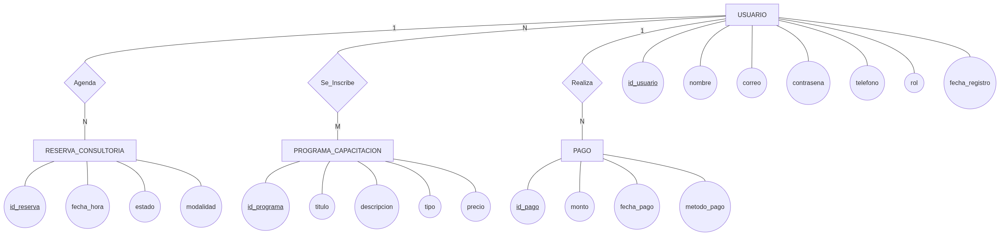
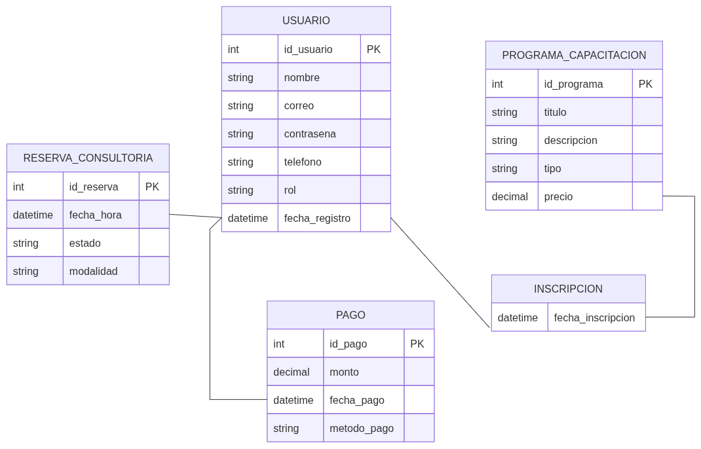
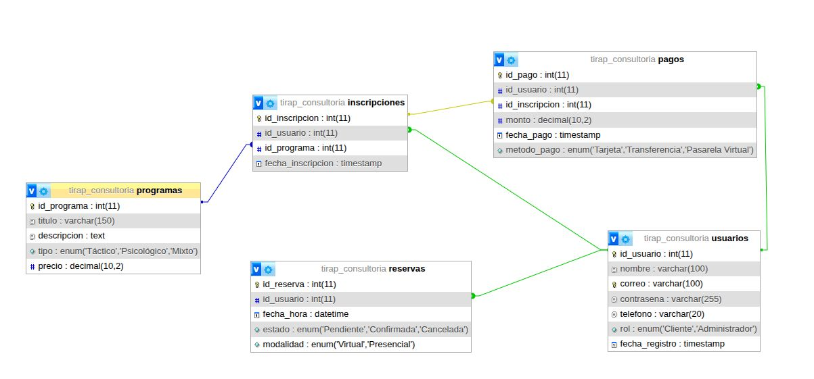
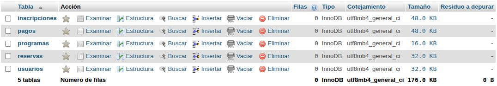

# BIMESTRAL: TACTICAL MIND & SHOOTING
## Planteamiento del Problema
### Causas
Estrés de alta intensidad no gestionado: Personal de seguridad, deportistas de tiro y operadores en campo enfrentan niveles de adrenalina que alteran el ritmo cardíaco, la visión de túnel y la toma de decisiones.

Falta de entrenamiento psicológico especializado: La mayoría de las capacitaciones se enfocan únicamente en la técnica física y omiten el condicionamiento mental (respiración diafragmática, control del pulso y enfoque bajo presión).

Ausencia de plataformas digitales integradas: No existen entornos virtuales dedicados a conectar a tiradores de alta precisión con metodologías de entrenamiento táctico-psicológico personalizado.

### Consecuencias
Fallas en la toma de decisiones críticas: Errores tácticos en situaciones de riesgo por pánico o saturación mental.

Bajo rendimiento en entornos de alta presión: Disminución de la precisión de tiro debido al descontrol fisiológico (temblor, taquicardia).

Desgaste psicológico y fatiga operativa: Secuelas de estrés postraumático o burnout por falta de herramientas de autorregulación emocional.

### Problema
El personal expuesto a entornos de alta presión carece de una plataforma accesible para capacitarse en técnicas psicológicas y tácticas avanzadas de tiro de alta precisión que les permitan dominar el autocontrol fisiológico y tomar decisiones certeras en tiempo récord.

### Aporte
Creación de un portal web interactivo que ofrece servicios de consultoría, capacitaciones tácticas, módulos de preparación psicológica para el control del estrés bajo presión, y venta de guías avanzadas para tiradores y personal especializado.

# 2. Épicas e Historias de Usuario

## Épica 1: Gestión de Usuarios y Perfiles

| ID | Historia de Usuario | Rol / Actor | Quiero (Funcionalidad) | Para (Beneficio / Objetivo) | Criterios de Aceptación |
| :---: | :--- | :--- | :--- | :--- | :--- |
| **HU01** | Registro de nuevos clientes | Cliente | Registrarme en el sitio web | Acceder a los cursos y consultar los servicios tácticos disponibles. | - Formulario de registro con validación de datos (correo, contraseña, nombre). - Confirmación de registro vía correo electrónico. - Mensajes claros de error en caso de datos duplicados o inválidos. |
| **HU02** | Inicio de sesión seguro | Usuario registrado | Iniciar sesión de forma segura | Visualizar mis capacitaciones compradas y mi progreso. | - Autenticación mediante credenciales (email/contraseña). - Redirección al panel o dashboard personal. - Opción de "Olvidé mi contraseña" para recuperación de cuenta. |

---

## Épica 2: Catálogo de Servicios y Formación Táctica

| ID | Historia de Usuario | Rol / Actor | Quiero (Funcionalidad) | Para (Beneficio / Objetivo) | Criterios de Aceptación |
| :---: | :--- | :--- | :--- | :--- | :--- |
| **HU03** | Exploración del catálogo táctico | Cliente | Explorar los programas de entrenamiento en tiro y preparación psicológica | Seleccionar el que se adapte a mis necesidades. | - Vista general de catálogo con filtros por categoría (Tiro, Preparación Psicológica, etc.). - Búsqueda por palabras clave. - Tarjetas de presentación resumida para cada programa. |
| **HU04** | Detalle del programa de formación | Cliente | Ver la descripción detallada, costos y requisitos de cada programa | Tomar una decisión de compra informada. | - Visualización de precio, temario/contenido, duración y requisitos previos. - Botón visible de compra o inscripción. - Sección de preguntas frecuentes o valoraciones si aplica. |

---

## Épica 3: Reservas y Consultorías

| ID | Historia de Usuario | Rol / Actor | Quiero (Funcionalidad) | Para (Beneficio / Objetivo) | Criterios de Aceptación |
| :---: | :--- | :--- | :--- | :--- | :--- |
| **HU05** | Agendamiento de consultoría personalizada | Cliente | Agendar una sesión de consultoría personalizada en preparación psicológica bajo presión | Recibir asesoría directa. | - Calendario interactivo con fechas y horarios disponibles. - Selección de tipo de consultoría y confirmación de datos. - Notificación/recordatorio de la cita por correo. |
| **HU06** | Gestión del calendario de citas | Administrador | Gestionar el calendario de citas | Confirmar o reprogramar las consultorías solicitadas. | - Panel de administración para ver solicitudes pendientes. - Opciones para aceptar, rechazar o proponer un nuevo horario. - Notificación automática al cliente ante cambios de estado. |

---

## Épica 4: Pagos y Descargas

| ID | Historia de Usuario | Rol / Actor | Quiero (Funcionalidad) | Para (Beneficio / Objetivo) | Criterios de Aceptación |
| :---: | :--- | :--- | :--- | :--- | :--- |
| **HU07** | Pago en línea y acceso a descargas | Cliente | Realizar el pago de cursos o guías tácticas en línea | Obtener acceso inmediato al material. | - Pasarela de pago segura integrada. - Generación de comprobante/factura digital. - Desbloqueo automático del contenido o enlaces de descarga al confirmar el pago. |

## Modelo entidad-relación

## modelo relacional

## modelo fisico

## base de datos
